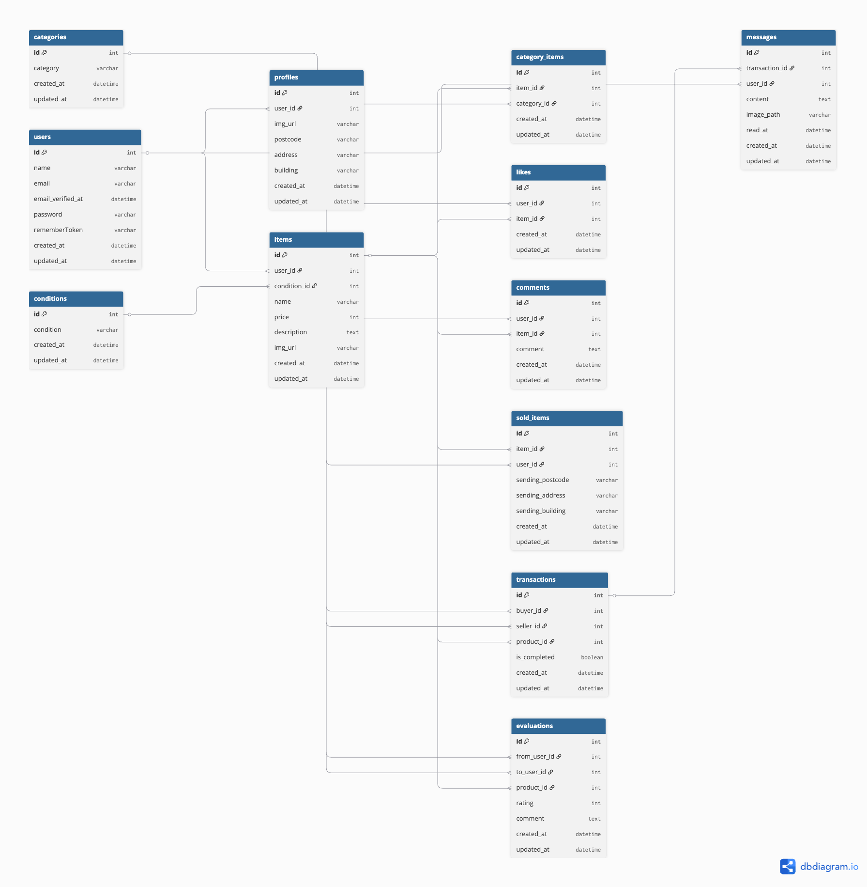

# 環境構築

1. Dockerを起動する

2. プロジェクト直下で、以下のコマンドを実行する

```
make init
```

※Makefileは実行するコマンドを省略することができる便利な設定ファイルです。コマンドの入力を効率的に行えるようになります。<br>

## メール認証
mailtrapというツールを使用しています。<br>
以下のリンクから会員登録をしてください。　<br>
https://mailtrap.io/

メールボックスのIntegrationsから 「laravel 7.x and 8.x」を選択し、　<br>
.envファイルのMAIL_MAILERからMAIL_ENCRYPTIONまでの項目をコピー＆ペーストしてください。　<br>
MAIL_FROM_ADDRESSは任意のメールアドレスを入力してください。　

## Stripeについて
コンビニ支払いとカード支払いのオプションがありますが、決済画面にてコンビニ支払いを選択しますと、レシートを印刷する画面に遷移します。そのため、カード支払いを成功させた場合に意図する画面遷移が行える想定です。<br>

また、StripeのAPIキーは以下のように設定をお願いいたします。
```
STRIPE_PUBLIC_KEY="パブリックキー"
STRIPE_SECRET_KEY="シークレットキー"
```
**テスト時は以下のカード番号を使用してください。**

### テストカード情報（3Dセキュア対応）
| 項目 | 入力例 |
|------|--------|
| カード番号 | 4000 0000 0000 3220 |
| 有効期限 | 12 / 34（未来の日付ならOK） |
| CVC | 123（任意の3桁） |
| カード名義 | TEST USER（任意） |

※ 決済画面で「3Dセキュア認証」の画面が出た場合は、  
「認証を成功させる」を選択してください。  

### エラーが出る場合
以下のようなエラーが出る場合は、3Dセキュア非対応カードを使っている可能性があります。

以下のリンクは公式ドキュメントです。<br>
https://docs.stripe.com/payments/checkout?locale=ja-JP
## テーブル仕様
### usersテーブル
| カラム名 | 型 | primary key | unique key | not null | foreign key |
| --- | --- | --- | --- | --- | --- |
| id | bigint | ◯ |  | ◯ |  |
| name | varchar(255) |  |  | ◯ |  |
| email | varchar(255) |  | ◯ | ◯ |  |
| email_verified_at | timestamp |  |  |  |  |
| password | varchar(255) |  |  | ◯ |  |
| remember_token | varchar(100) |  |  |  |  |
| created_at | timestamp |  |  |  |  |
| updated_at | timestamp |  |  |  |  |

### profilesテーブル
| カラム名 | 型 | primary key | unique key | not null | foreign key |
| --- | --- | --- | --- | --- | --- |
| id | bigint | ◯ |  | ◯ |  |
| user_id | bigint |  |  | ◯ | users(id) |
| img_url | varchar(255) |  |  |  |  |
| postcode | varchar(255) |  |  | ◯ |  |
| address | varchar(255) |  |  | ◯ |  |
| building | varchar(255) |  |  |  |  |
| created_at | timestamp |  |  |  |  |
| updated_at | timestamp |  |  |  |  |

### itemsテーブル
| カラム名 | 型 | primary key | unique key | not null | foreign key |
| --- | --- | --- | --- | --- | --- |
| id | bigint | ◯ |  | ◯ |  |
| user_id | bigint |  |  | ◯ | users(id) |
| condition_id | bigint |  |  | ◯ | conditions(id) |
| name | varchar(255) |  |  | ◯ |  |
| price | int |  |  | ◯ |  |
| brand | varchar(255) |  |  |  |  |
| description | varchar(255) |  |  | ◯ |  |
| img_url | varchar(255) |  |  | ◯ |  |
| created_at | timestamp |  |  |  |  |
| updated_at | timestamp |  |  |  |  |

### commentsテーブル
| カラム名 | 型 | primary key | unique key | not null | foreign key |
| --- | --- | --- | --- | --- | --- |
| id | bigint | ◯ |  | ◯ |  |
| user_id | bigint |  |  | ◯ | users(id) |
| item_id | bigint |  |  | ◯ | items(id) |
| comment | varchar(255) |  |  | ◯ |  |
| created_at | timestamp |  |  |  |  |
| updated_at | timestamp |  |  |  |  |

### likesテーブル
| カラム名 | 型 | primary key | unique key | not null | foreign key |
| --- | --- | --- | --- | --- | --- |
| user_id | bigint |  | ◯(item_idとの組み合わせ) | ◯ | users(id) |
| item_id | bigint |  | ◯(user_idとの組み合わせ) | ◯ | items(id) |
| created_at | timestamp |  |  |  |  |
| updated_at | timestamp |  |  |  |  |

### sold_itemsテーブル
| カラム名 | 型 | primary key | unique key | not null | foreign key |
| --- | --- | --- | --- | --- | --- |
| user_id | bigint |  |  | ◯ | users(id) |
| item_id | bigint |  |  | ◯ | items(id) |
| sending_postcode | varchar(255) |  |  | ◯ |  |
| sending_address | varchar(255) |  |  | ◯ |  |
| sending_building | varchar(255) |  |  |  |  |
| created_at | timestamp |  |  |  |  |
| updated_at | timestamp |  |  |  |  |

### category_itemsテーブル
| カラム名 | 型 | primary key | unique key | not null | foreign key |
| --- | --- | --- | --- | --- | --- |
| item_id | bigint |  | ◯(category_idとの組み合わせ) | ◯ | items(id) |
| category_id | bigint |  | ◯(item_idとの組み合わせ) | ◯ | categories(id) |
| created_at | timestamp |  |  |  |  |
| updated_at | timestamp |  |  |  |  |

### categoriesテーブル
| カラム名 | 型 | primary key | unique key | not null | foreign key |
| --- | --- | --- | --- | --- | --- |
| id | bigint | ◯ |  | ◯ |  |
| category | varchar(255) |  |  | ◯ |  |
| created_at | timestamp |  |  |  |  |
| updated_at | timestamp |  |  |  |  |

### conditionsテーブル
| カラム名 | 型 | primary key | unique key | not null | foreign key |
| --- | --- | --- | --- | --- | --- |
| id | bigint | ◯ |  | ◯ |  |
| condition | varchar(255) |  |  | ◯ |  |
| created_at | timestamp |  |  |  |  |
| updated_at | timestamp |  |  |  |  |

### transactionsテーブル
| カラム名 | 型 | primary key | unique key | not null | foreign key |
| --- | --- | --- | --- | --- | --- |
| id | bigint | ◯ |  | ◯ |  |
| buyer_id | bigint |  |  | ◯ | users(id) |
| seller_id | bigint |  |  | ◯ | users(id) |
| product_id | bigint |  |  | ◯ | items(id) |
| is_completed | boolean |  |  | ◯ |  |
| created_at | timestamp |  |  |  |  |
| updated_at | timestamp |  |  |  |  |

### messagesテーブル
| カラム名 | 型 | primary key | unique key | not null | foreign key |
| --- | --- | --- | --- | --- | --- |
| id | bigint | ◯ |  | ◯ |  |
| transaction_id | bigint |  |  | ◯ | transactions(id) |
| user_id | bigint |  |  | ◯ | users(id) |
| content | text |  |  | ◯ |  |
| image_path | varchar(255) |  |  |  |  |
| read_at | timestamp |  |  |  |  |
| created_at | timestamp |  |  |  |  |
| updated_at | timestamp |  |  |  |  |

### evaluationsテーブル
| カラム名 | 型 | primary key | unique key | not null | foreign key |
| --- | --- | --- | --- | --- | --- |
| id | bigint | ◯ |  | ◯ |  |
| from_user_id | bigint |  |  | ◯ | users(id) |
| to_user_id | bigint |  |  | ◯ | users(id) |
| product_id | bigint |  |  | ◯ | items(id) |
| rating | int |  |  | ◯ |  |
| comment | text |  |  |  |  |
| created_at | timestamp |  |  |  |  |
| updated_at | timestamp |  |  |  |  |

## ER図


## テストアカウント一覧

本アプリでは機能を追加するという想定ため2つのテスト用アカウントを用意しています。  
README確認用にログインして追加の機能動作確認を行ってください。

### 通常ログイン用（一般ユーザー）
- ユーザー1  
  - email: general1@gmail.com  
  - password: password  

- ユーザー2  
  - email: general2@gmail.com  
  - password: password  

### README確認用（ダミーデータ）
- ユーザーA
  - email: seller1@example.com  
  - password: password  

- ユーザーB
  - email: general2@gmail.com  
  - password: password  

- ユーザーC（未使用アカウント）  
  - email: unused@example.com  
  - password: password  

## PHPUnitを利用したテストに関して
以下のコマンド:  
```
//テスト用データベースの作成
docker-compose exec mysql bash
mysql -u root -p
//パスワードはrootと入力
create database test_database;

docker-compose exec php bash
php artisan migrate:fresh --env=testing
./vendor/bin/phpunit
```
※.env.testingにもStripeのAPIキーを設定してください。 

## マイグレーション＆README用シーディング
docker-compose exec php php artisan migrate:fresh
docker-compose exec php php artisan db:seed --class=UsersTableSeeder
docker-compose exec php php artisan db:seed --class=ProfilesTableSeeder
docker-compose exec php php artisan db:seed --class=ConditionsTableSeeder
docker-compose exec php php artisan db:seed --class=CategoriesTableSeeder
docker-compose exec php php artisan db:seed --class=ItemsReadmeSeeder
docker-compose exec php php artisan db:seed --class=CategoryItemsTableSeeder
docker-compose exec php php artisan db:seed --class=TransactionsReadmeSeeder

### 💡 購入・取引動作確認について

以下のデータをもとに動作確認が可能です。

| 状態 | 商品ID | 備考 |
|:--|:--|:--|
| 出品中 | 1, 6 | `unused@example.com` でログインし購入テスト可能 |
| 取引中 | 2, 7 | 「取引中の商品」タブから取引チャット画面へ遷移可 |
| 取引完了 | 3, 4, 5, 8, 9, 10 | 「購入した商品」タブにのみ表示される |

